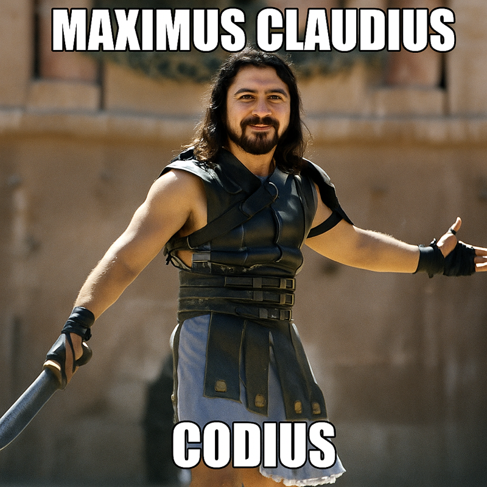

# Claudio

A project analysis and planning system that transforms any codebase into an organized, trackable development process through specialized AI agents and project localization.

## What is Claudio?



Claudio orchestrates discovery, requirements, planning, and task organization through 77+ specialized AI agents with standardized coordination patterns that work together to **analyze, plan, and implement** project solutions. The system uses a **mature agent-based architecture** with universal argument extraction where components are **intelligently customized for each project** based on comprehensive discovery analysis of technology stack, architecture patterns, and project requirements.

The system transforms ad-hoc development into systematic, trackable, and collaborative project execution through intelligent project localization, anti-fabrication policies, and comprehensive workflow automation.

## Requirements

- **Claude Code CLI**: This system is designed for use with [Claude Code](https://claude.ai/code)
- The Claude Code CLI provides the runtime environment and tools that Claudio agents use
- No additional installations required - Claudio works within your existing Claude Code setup

## Documentation

### Core Documentation
- **[Usage Guide](docs/usage-guide.md)** - Complete command reference, workflow examples, and practical usage patterns
- **[System Architecture](docs/system-architecture.md)** - Extended context structure, agent integration, and technical implementation details
- **[Specialized Features](docs/specialized-features.md)** - Research system, Claude SDK capabilities, and advanced features
- **[Best Practices](docs/best-practices.md)** - Development workflows, context management, and integration guidance
- **[Changelog Management](docs/changelog-management.md)** - Maintenance protocol and update procedures

**Table of Contents:** [What is Claudio?](#what-is-claudio) | [Documentation](#documentation) | [Requirements](#requirements) | [Quick Start](#quick-start) | [Key Features](#key-features) | [Commands](#commands) | [Installation](#installation) | [Project Structure](#project-structure) | [Document Types](#document-types-in-claudio) | [Advanced Features](#advanced-features) | [Development](#development) | [Troubleshooting](#troubleshooting)

## Quick Start

*Note: Where you start your Claude session determines automatic project memory loading from CLAUDE.md files. We take advantage of this behavior until Claude supports alternative methods for project context loading.*

### Setup Phase
```bash
# 1. Clone Claudio
git clone <this-repo>
cd claudio

# 2. Start Claude with directory access to your project  
claude --add-dir /path/to/my-code

# 3. Run Claudio system command
/claudio:claudio /path/to/my-code
# Optional: Use install-only command instead
/claudio:install /path/to/my-code

# 4. Exit Claude session
exit
```

### Usage Phase
```bash
# 1. Navigate to your project
cd /path/to/my-code

# 2. Start Claude session (loads project CLAUDE.md automatically)
claude

# 3. Use project commands
# Optional: Create additional plans
/claudio:plan feature "my new feature, add to project phases"
/claudio:implement  # Follows plans created by claudio workflow or install
/claudio:test
# Natural language: "use the claudio workflow to add my new feature to the phased planning documents"
```

### Upgrade Phase
```bash
# 1. Update Claudio (choose one method)
# From your project directory:
git submodule update --remote
# OR from the claudio directory:
cd claudio && git pull

# 2. Navigate to Claudio directory
cd claudio
# Note: Use `pwd` to verify your current directory

# 3. Start Claude with directory access to your project
claude --add-dir /path/to/my-code

# 4. Run Claudio upgrade command
/claudio:upgrade /path/to/my-code

# 5. Exit Claude session
exit
```

## Key Features

### Agent Coordination System
- **Universal Argument Extraction**: All 77+ agents implement standardized argument extraction logic for consistent project path handling and cross-agent communication
- **Anti-Fabrication Standards**: System-wide policies ensure outputs are based on actual project analysis with factual, measurable results
- **Template System**: Comprehensive template library in extended_context/templates/ provides consistent patterns for agent and command development
- **Project Path Isolation**: Robust path handling prevents system contamination during multi-project workflows

### Discovery System
- **Parallel Analysis Architecture**: 5 specialized agents analyze project structure, technology stack, architecture patterns, integration opportunities, and consolidate findings simultaneously
- **Technology Stack Detection**: Automatic framework identification, dependency analysis, and build system assessment
- **Architecture Analysis**: Design patterns, component relationships, and structural analysis with integration recommendations
- **Project Classification**: Smart categorization with localization recommendations for optimal workflow customization

### Project Localization
- **Component Customization**: Agents and commands adapt to specific project context through discovery analysis
- **Technology-Aware Workflows**: Framework-specific procedures and commands tailored to detected technology stack
- **Generated Test Integration**: Project-specific test commands created during installation based on detected testing frameworks
- **System vs User Components**: Smart filtering ensures only workflow-relevant components are installed to user projects

### Documentation & Research
- **Project-Specific Documentation**: README and CLAUDE.md generation with technology stack-aware content and integration guidance
- **Research System**: Topic research with complexity assessment, adaptive thinking modes (Think/Ultrathink), and authoritative source integration
- **Parallel Documentation Updates**: Coordinated maintenance through specialized agents (readme-updater, claude-md-updater, changelog-updater)
- **Quality Documentation**: Discovery-driven documentation generation with validation and accuracy checks

### Quality Assurance & Security
- **Comprehensive Validation**: Quality assurance framework with specialized validators for discovery, workflow, installation, and command generation
- **Security Analysis**: STRIDE-based security review with visual threat modeling and technology-specific assessments
- **Code Quality Assessment**: Language and framework-specific analysis with detailed reporting and remediation suggestions
- **Testing Integration**: Intelligent test execution with failure analysis, fix capabilities, and project-specific test command generation

### System Management & Development
- **Parallel Upgrade System**: 7 specialized agents handle discovery analysis, legacy cleanup, template analysis, backup management, component localization, and validation
- **Custom Command Generation**: Complete command system creation (command + sub-agent + context) from research sources with Claudio integration
- **Claude SDK Development**: Analysis and improvement of Claude Code implementations with cross-system comparison capabilities
- **Git Integration**: Intelligent commit message generation following project conventions and change analysis

## Commands

### Core Workflow Commands
| Command | Purpose | Example |
|---------|---------|---------|
| `/claudio:claudio` | Project discovery & planning | `/claudio:claudio ../my-app` |
| `/claudio:discovery` | Parallel project analysis using 5 agents | `/claudio:discovery ./backend` |
| `/claudio:documentation` | Generate docs | `/claudio:documentation api ./my-api` |
| `/claudio:prd` | Create requirements | `/claudio:prd feature chat-system` |
| `/claudio:plan` | Implementation planning | `/claudio:plan project app "12 weeks"` |
| `/claudio:task` | Break down into tasks | `/claudio:task plan.md my-project` |
| `/claudio:research` | Topic research with complexity assessment | `/claudio:research security oauth2` |
| `/claudio:update-docs` | Update project documentation | `/claudio:update-docs "enhanced features"` |
| `/claudio:design` | UX/UI analysis & specs | `/claudio:design audit ./my-app material` |
| `/claudio:security-review` | STRIDE security analysis | `/claudio:security-review ./my-app` |

### Implementation & Execution
| Command | Purpose | Example |
|---------|---------|---------|
| `/claudio:implement` | Execute implementation plans | `/claudio:implement ../my-project` |
| `/claudio:test` | Run project tests with analysis | `/claudio:test` or `/claudio:test --fix` |
| `/claudio:test-g` | Gemini-enhanced testing with coordinator workflow | `/claudio:test-g` |

### System Management
| Command | Purpose | Example |
|---------|---------|---------|
| `/claudio:install` | Install Claudio components | `/claudio:install` or `/claudio:install commands user` |
| `/claudio:upgrade` | Parallel upgrade system | `/claudio:upgrade` or `/claudio:upgrade /path/to/project` |

### Utilities
| Command | Purpose | Example |
|---------|---------|---------|
| `/claudio:new-command` | Generate custom commands | `/claudio:new-command my-tool "analyzes dependencies" https://docs.npmjs.com` |
| `/claudio:newprompt` | Create new agent prompts | `/claudio:newprompt security-review "vulnerability analysis" standard` |
| `/claudio:test-review` | Analyze testing patterns | `/claudio:test-review` |
| `/claudio:gcms` | Generate git commit messages | `/claudio:gcms` |
| `/claudio:code-quality` | Code quality assessment | `/claudio:code-quality full ./my-project` |
| `/claudio:claude-sdk` | Claude Code implementation analysis | `/claudio:claude-sdk command_name` |

## Installation

### Installing Claudio Components

Claudio provides mature installation workflows with standardized component management and intelligent project localization:

#### Installation Modes

**Project Mode** (Default - Recommended):
```bash
# Install complete localized Claudio system in current project
/claudio:install

# Install localized commands only in current project  
/claudio:install commands
```
Creates `.claude/` folder in current directory with project-localized Claudio system featuring technology-aware customization through discovery analysis.

**User Mode** (Global Installation):
```bash
# Install generic commands globally for user
/claudio:install commands user
```
Installs standardized Claudio templates to `~/.claude/` for system-wide access across all projects.

**Custom Path Mode**:
```bash
# Install localized system to specific location
/claudio:install /path/to/project
/claudio:install commands /path/to/custom/location
```
Installs fully customized Claudio system to any specified directory with comprehensive discovery analysis and technology-specific localization.

### Upgrading Claudio

Keep your Claudio installation current with the upgrade system:

#### Check for Updates
```bash
# Preview available upgrades for current directory
/claudio:upgrade --check

# Check specific project installation
/claudio:upgrade /path/to/project --check
```

#### Perform Upgrades
```bash
# Upgrade current directory with re-localization
/claudio:upgrade

# Upgrade specific project with localization refresh
/claudio:upgrade /path/to/project

# Force complete re-discovery and re-localization
/claudio:upgrade --force
```

#### Safety Features
- **Automatic Backups**: Complete backup created before any changes
- **Changelog Generation**: Detailed record of all modifications
- **Rollback Support**: Easy reversion to previous versions
- **Context Preservation**: Existing project contexts maintained during upgrades

## Project Structure

```
claudio/
├── .claude/
│   ├── commands/claudio/     # All executable commands
│   └── agents/claudio/       # Agent implementations  
│       └── extended_context/ # Knowledge contexts by category
└── .claudio/                 # Generated project analysis
    ├── discovery.md          # Project analysis
    ├── prd.md               # Requirements  
    ├── plan.md              # Implementation roadmap
    └── phase*/              # Task breakdown
```

### Generated Project Structure
When Claudio analyzes a project, it creates:

```
your-project/
└── .claudio/
    ├── summary.md          # Executive overview
    ├── discovery.md        # Technology analysis  
    ├── prd.md             # Requirements
    ├── plan.md            # Implementation roadmap
    ├── status.md          # Progress tracking
    ├── research/          # Topic-specific research
    ├── docs/              # Generated documentation
    │   └── security/      # Security analysis
    └── phase1/, phase2/   # Task breakdown with contexts
```

## Document Types in Claudio

### **Research Documents** 📚
**Purpose**: Topic-specific knowledge created when understanding technologies or methodologies  
**Location**: `.claudio/research/[category]/[topic]/`  
**Creation**: Generated by `/claudio:research` when knowledge gaps are identified  
**Content**: Overview documentation, troubleshooting guides, best practices, implementation patterns  
**Example**: PostgreSQL optimization techniques, React testing strategies, security best practices  

### **Implementation Plans** 📋
**Purpose**: Detailed implementation roadmaps created from project requirements  
**Location**: `.claudio/plan.md`  
**Creation**: Generated by `/claudio:plan` after requirements analysis (PRD)  
**Content**: Implementation phases, task breakdown, dependencies, resource needs - **based on actual project analysis**  
**Example**: User authentication system implementation with phases derived from your codebase discovery  
**Note**: Plans use real analysis data, never fabricated timelines or metrics

### **Phase Documents** ✅
**Purpose**: Executable tasks broken down from implementation plans  
**Location**: `.claudio/phase1/`, `.claudio/phase2/` directories  
**Creation**: Generated by `/claudio:task` after you have a plan  
**Content**: Specific tasks with acceptance criteria, implementation contexts, progress tracking  
**Example**: Individual tasks like "Create JWT middleware" with detailed acceptance criteria  

### **Extended Context** 🧠
**Purpose**: Specialized knowledge that enhances Claudio agent capabilities  
**Location**: `.claude/agents/claudio/extended_context/[category]/[topic]/`  
**Creation**: Created during system setup to provide agents with domain expertise  
**Content**: Agent instruction enhancements, methodology guides, evaluation frameworks  
**Example**: Planning agent context that helps create better implementation strategies  

### **Document Flow**
```
Research (knowledge) → Plans (roadmaps) → Phase Docs (executable tasks)
                ↗
        Extended Context (enables agents at each step)
```

**Workflow**: Research informs plan creation from requirements. Plans get broken down into executable phase documents. Extended context provides agents the expertise to perform each step effectively.

## Advanced Features

### Custom Command Generation

Generate complete command systems (command + sub-agent + context) from research sources:

```bash
# Create from URL research
/claudio:new-command dependency-analyzer "analyzes project dependencies" https://docs.npmjs.com/cli/v8/commands/npm-audit

# Create from local documentation
/claudio:new-command api-validator "validates API endpoints" ./api-spec.md

# Integrate with Claudio workflow
/claudio:new-command security-scan "performs security analysis" https://owasp.org/www-project-top-ten/ --claudio "after discovery workflow"
```

### Project-Specific Testing

Claudio automatically generates customized test commands for each project:

- **Framework Detection**: Detection of testing frameworks (Jest, pytest, ExUnit, Go test, etc.)
- **Test Reporting**: Test result analysis and failure diagnosis
- **Fix Capabilities**: Failure analysis and repair suggestions with `--fix` flag
- **Project-Specific Commands**: Generated test commands during installation based on discovery analysis

### Research System

Create structured documentation with complexity-aware analysis:

```bash
/claudio:research development react-testing  # Create research documentation
```

**Features**:
- **Complexity Assessment**: Evaluation with Think/Ultrathink modes for topics
- **Quality Standards**: Includes sources, practical examples, and analysis depth
- **Context Detection**: Determines proper file placement for direct vs subagent usage

### Template System

Comprehensive template library provides consistent patterns for system development:

```
.claude/agents/claudio/extended_context/templates/
├── agents/                          # Agent development templates
│   ├── analysis-agent-template.md   # Analysis specialist patterns
│   ├── orchestrator-agent-template.md # Coordinator patterns
│   ├── specialist-agent-template.md # Domain specialist patterns
│   └── validation-agent-template.md # Quality assurance patterns
├── commands/                        # Command development templates
│   └── test-g-command-template.md   # Test command patterns
└── meta/                           # Meta-development templates
    └── claude/commands/templates/   # Complete command system templates
```

**Template Features**:
- **Standardized Patterns**: Consistent structure across all agents and commands
- **Anti-Fabrication Integration**: Built-in factual output requirements
- **Argument Extraction**: Universal argument handling patterns
- **Quality Standards**: Comprehensive validation and reporting templates

### Implementation Execution

Beyond planning, Claudio can execute your implementation plans:

```bash
# Default workflow: discovery and planning combined
/claudio:claudio ../my-project

# Optional: execute implementation when ready
/claudio:implement ../my-project
```

**Implementation Modes**:
- Execute complete implementation plan
- Execute specific phases or tasks
- Resume interrupted execution
- Preview execution plan (dry run)
- Control parallel execution

## Development

### Agent-Based Architecture

Claudio employs a comprehensive system of 77+ specialized AI agents with standardized coordination patterns and universal argument extraction for reliable project analysis:

#### Standardized Agent Patterns
- **Universal Argument Extraction**: All agents implement consistent argument parsing for project path handling
- **Anti-Fabrication Compliance**: Agents produce factual outputs based on actual project analysis
- **Template Integration**: Agents reference comprehensive template library in extended_context/templates/
- **Model Optimization**: Strategic model distribution across Haiku (11), Sonnet 4 (58), and Opus 4.1 (8) agents

#### Discovery System (Parallel Architecture)
- **discovery-agent**: Orchestrates parallel project analysis using 5 specialized analyzers
- **discovery-structure-analyzer**: Project organization, file patterns, hierarchy mapping
- **discovery-tech-analyzer**: Technology stack detection, framework identification
- **discovery-architecture-analyzer**: Design patterns, architectural style, component relationships
- **discovery-integration-analyzer**: Tool integration opportunities, API analysis
- **discovery-consolidator**: Analysis integration and report generation

#### Quality Assurance & Security
- **security-review-coordinator**: STRIDE-based security analysis with visual threat modeling
- **code-quality-analyzer**: Code quality assessment with reporting
- **discovery-validator**: Validates discovery document quality and analysis depth
- **workflow-validator**: Validates workflow output and document completeness

#### Documentation & Research
- **documentation-coordinator**: Generates documentation (README, API docs, user guides)
- **user-readme-generator-agent**: Creates project-specific README documentation with technology stack-aware content
- **claude-md-generator-agent**: Generates technology stack-aware project-specific CLAUDE.md
- **research-specialist**: Conducts topic research with complexity assessment and adaptive thinking modes

#### System Management
- **install-full-workflow-agent**: Manages Claudio installation with project-specific customization
- **Parallel Upgrade System**: 7 specialized agents for discovery analysis, legacy cleanup, template analysis, backup management, localization, and validation

### Validation System

Claudio includes a quality assurance framework:

- **Discovery Validator**: Validates discovery document quality and analysis depth
- **Workflow Validator**: Validates Claudio workflow output quality
- **Install Validator**: Validates installation completeness and functionality
- **New Command Validator**: Validates custom command generation quality

Each validator generates reports with pass/fail status, findings, recommendations, and quality metrics.

## Troubleshooting

### Common Issues

#### Node.js Memory Issues
If Claude Code crashes with "JavaScript heap out of memory" errors:

```bash
# Quick fix
export NODE_OPTIONS="--max-old-space-size=8192" && claude-code

# Permanent solution (add to ~/.zshrc or ~/.bashrc)
export NODE_OPTIONS="--max-old-space-size=8192"
```

### Getting Help

- **System Documentation**: Read `CLAUDE.md` for detailed system documentation
- **Sample Projects**: Explore `examples/` for sample projects to analyze
- **Installation Help**: Use `/claudio:install --help` or `/claudio:upgrade --help`
- **Status Checking**: Use `/claudio:upgrade --status` to verify your installation

Start by telling Claude: **"Please use claudio:claudio on /path/to/my/project"** and use the parallel specialist agent discovery system with project understanding!
