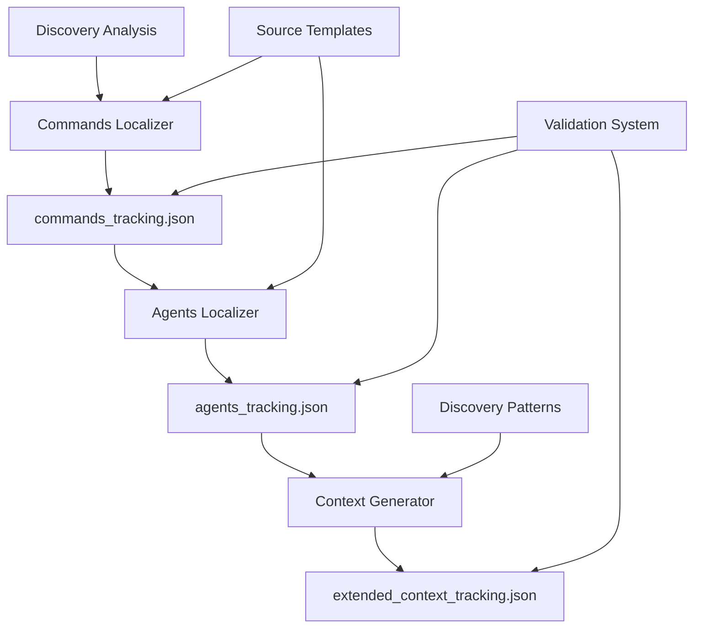

# Install/Upgrade Discovery-Driven Resource Generation Tracking

## Critical Understanding: Generation vs. Copying

**Key Rule**: Commands, agents, and extended_context are **NEVER copied** - they are **generated and localized** based on discovery documents in `.claudio/docs/`.

## Todo List Format (Agent Execution Plan)

### 1. Create Source Template Index Infrastructure
- **Status**: completed
- **Content**: Create comprehensive source template index mapping templates to generation patterns and discovery dependencies
- **Active Form**: Creating source template index with generation patterns and discovery dependencies

### 2. Write Revised Plan with Generation-Based Approach
- **Status**: completed
- **Content**: Document revised generation-based tracking plan in install_upgrade.md
- **Active Form**: Documenting revised generation-based tracking plan

### 3. Design Discovery-Driven Generation Tracking System
- **Status**: completed
- **Content**: Design tracking system that captures discovery analysis → template selection → resource generation pipeline
- **Active Form**: Creating discovery-driven generation tracking system

### 4. Update Commands Localizer for Generation Tracking
- **Status**: completed
- **Content**: Update commands localizer to track: source templates used + discovery findings + generated commands
- **Active Form**: Updating commands localizer to track generation pipeline

### 5. Update Agents Localizer for Generation Tracking
- **Status**: completed
- **Content**: Update agents localizer to track: source templates used + discovery findings + generated agents + required context
- **Active Form**: Updating agents localizer to track generation pipeline

### 6. Update Context Generator for Generation Tracking
- **Status**: completed
- **Content**: Update context generator to track: discovery findings + agent requirements + generated context files
- **Active Form**: Updating context generator to track generation pipeline

### 7. Create Discovery Analysis Index
- **Status**: completed
- **Content**: Create discovery analysis index with localization mappings for different technology stacks and architectures
- **Active Form**: Creating discovery analysis index with localization mappings

### 8. Implement Generation Validation System
- **Status**: completed
- **Content**: Implement generation validation system to ensure generated resources match discovery analysis
- **Active Form**: Creating generation validation and consistency checking

### 9. Update Workflow Commands for Generation Tracking
- **Status**: completed
- **Content**: Update install/upgrade/claudio commands to coordinate discovery-driven generation tracking
- **Active Form**: Implementing generation-based tracking in workflow commands

## Implementation Details

### Sequential Tracking JSON Structure

The tracking system uses three sequential JSON files that create the dependency chain between installation agents:

#### **1. Commands Tracking JSON**
**`.claudio/shared/commands_tracking.json`** - Written by `install-commands-localizer-agent`:
```json
{
  "timestamp": "2025-08-24T10:30:00Z",
  "project_path": "./my-project",
  "discovery_source": ".claudio/docs/discovery.md",
  "discovery_drivers": {
    "technology_stack": ["nodejs", "react", "postgresql"],
    "architecture": "microservices", 
    "project_domain": "ecommerce"
  },
  "commands_generated": [
    {
      "command": "discovery",
      "source_template": "/.claude/commands/claudio/discovery.md",
      "generated_at": "./my-project/.claude/commands/claudio/discovery.md",
      "localizations_applied": ["nodejs_examples", "microservices_patterns"],
      "required_agents": ["discovery-agent"]
    },
    {
      "command": "claudio",
      "source_template": "/.claude/commands/claudio/claudio.md", 
      "generated_at": "./my-project/.claude/commands/claudio/claudio.md",
      "localizations_applied": ["ecommerce_examples", "microservices_workflows"],
      "required_agents": ["discovery-agent", "prd-agent", "plan-agent", "task-agent", "claudio-structure-creator-agent"]
    },
    {
      "command": "code-quality",
      "source_template": "/.claude/commands/claudio/code-quality.md",
      "generated_at": "./my-project/.claude/commands/claudio/code-quality.md", 
      "localizations_applied": ["nodejs_linting", "eslint_prettier_configs"],
      "required_agents": ["code-quality-analyzer"]
    }
  ]
}
```

#### **2. Agents Tracking JSON**
**`.claudio/shared/agents_tracking.json`** - Written by `install-agents-localizer-agent`:
```json
{
  "timestamp": "2025-08-24T10:35:00Z",
  "project_path": "./my-project",
  "input_source": ".claudio/shared/commands_tracking.json",
  "discovery_source": ".claudio/docs/discovery.md",
  "agents_generated": [
    {
      "agent": "discovery-agent",
      "source_template": "/.claude/agents/claudio/discovery-agent.md",
      "generated_at": "./my-project/.claude/agents/claudio/discovery-agent.md", 
      "localizations_applied": ["nodejs_analysis", "microservices_discovery", "ecommerce_patterns"],
      "extended_context_requirements": [
        "workflow/discovery/overview.md",
        "workflow/discovery/troubleshooting.md"
      ]
    },
    {
      "agent": "prd-agent",
      "source_template": "/.claude/agents/claudio/prd-agent.md",
      "generated_at": "./my-project/.claude/agents/claudio/prd-agent.md",
      "localizations_applied": ["ecommerce_requirements", "microservices_prd"],
      "extended_context_requirements": [
        "workflow/prd/overview.md",
        "workflow/prd/troubleshooting.md" 
      ]
    },
    {
      "agent": "code-quality-analyzer",
      "source_template": "/.claude/agents/claudio/code-quality-analyzer.md",
      "generated_at": "./my-project/.claude/agents/claudio/code-quality-analyzer.md",
      "localizations_applied": ["nodejs_quality_tools", "eslint_integration"],
      "extended_context_requirements": [
        "development/code_quality/overview.md",
        "development/code_quality/troubleshooting.md"
      ]
    }
  ]
}
```

#### **3. Extended Context Tracking JSON**
**`.claudio/shared/extended_context_tracking.json`** - Written by `install-extended-context-generator-agent`:
```json
{
  "timestamp": "2025-08-24T10:40:00Z",
  "project_path": "./my-project",
  "input_source": ".claudio/shared/agents_tracking.json",
  "discovery_source": ".claudio/docs/discovery.md",
  "context_generated": [
    {
      "context_file": "workflow/discovery/overview.md",
      "generated_at": "./my-project/.claude/agents/claudio/extended_context/workflow/discovery/overview.md",
      "content_customizations": ["nodejs_discovery_patterns", "microservices_analysis", "ecommerce_focus"],
      "required_by_agents": ["discovery-agent"]
    },
    {
      "context_file": "workflow/prd/overview.md", 
      "generated_at": "./my-project/.claude/agents/claudio/extended_context/workflow/prd/overview.md",
      "content_customizations": ["ecommerce_requirements", "microservices_prd_patterns"],
      "required_by_agents": ["prd-agent"]
    },
    {
      "context_file": "development/code_quality/overview.md",
      "generated_at": "./my-project/.claude/agents/claudio/extended_context/development/code_quality/overview.md", 
      "content_customizations": ["nodejs_quality_standards", "eslint_prettier_configs"],
      "required_by_agents": ["code-quality-analyzer"]
    }
  ]
}
```

### Source Templates Index Structure

**Source Templates Index** (`/.claude/templates/index.md`):
```markdown
# Source Templates Index

## Command Templates
- **discovery.md**: 
  - localization_drivers: [technology_stack, architecture]
  - generates: project-specific discovery command with tech examples
  - customization_patterns: [framework_examples, tool_integration]

## Agent Templates  
- **discovery-agent.md**:
  - localization_drivers: [technology_stack, project_domain, architecture]
  - generates: project-aware discovery agent with specialized capabilities
  - extended_context_needs: [workflow/discovery]
  - customization_patterns: [tech_specific_analysis, domain_patterns]
```

**Discovery Analysis Index** (`/.claudio/docs/discovery_patterns.md`):
```markdown
# Discovery Analysis Patterns

## Technology Stack Mappings
- **nodejs**: drives npm/yarn examples, Express patterns, Jest testing
- **react**: drives component examples, JSX patterns, React Testing Library
- **postgresql**: drives database examples, migration patterns, query examples

## Architecture Mappings
- **microservices**: drives service boundary analysis, API contracts, distributed patterns
- **monolith**: drives modular architecture, dependency management, scaling patterns

## Domain Mappings
- **ecommerce**: drives payment patterns, inventory examples, user management flows
```

### Discovery-Driven Generation Process

1. **Discovery Analysis Phase**:
   - Discovery agents analyze project → create `.claudio/docs/discovery.md`
   - Discovery findings include: technology stack, architecture, domain, complexity
   - These findings become the **drivers** for all localization decisions

2. **Template-Based Generation Phase**:
   - **Commands localizer**: Reads source templates + discovery → generates localized commands
   - **Agents localizer**: Reads source templates + discovery → generates localized agents
   - **Context generator**: Reads discovery + agent requirements → generates localized context

3. **Generation Tracking Phase**:
   - Track which **source templates** were used (not copied)
   - Track which **discovery findings** drove the localization
   - Track what **resources were generated** and where
   - Track what **customizations/localizations** were applied

### Agent Workflow with Sequential Tracking

#### **1. install-commands-localizer-agent**
**Input Requirements**:
- `{project_path}/.claudio/docs/discovery.md` (discovery analysis)
- Source command templates from `/.claude/commands/claudio/` (read, never copy)

**Process**:
- Read discovery analysis for localization drivers (technology_stack, architecture, project_domain)
- Read source command templates and extract structure
- Generate localized commands with discovery-driven customizations
- Apply technology-specific examples (Node.js, microservices, e-commerce patterns)

**Output**:
- Localized command files in `{project_path}/.claude/commands/claudio/`
- **Write `.claudio/shared/commands_tracking.json`** with:
  - Discovery drivers used
  - Source templates referenced
  - Commands generated with localizations applied
  - Required agents list for each command

#### **2. install-agents-localizer-agent**
**Input Requirements**:
- **Read `.claudio/shared/commands_tracking.json`** (required agents list)
- `{project_path}/.claudio/docs/discovery.md` (discovery analysis)
- Source agent templates from `/.claude/agents/claudio/` (read, never copy)

**Process**:
- Read commands tracking JSON to determine which agents are needed
- Read discovery analysis for technology-specific localizations
- Read source agent templates and extract structure
- Generate localized agents with technology-specific capabilities
- Apply project-appropriate tools and framework integrations

**Output**:
- Localized agent files in `{project_path}/.claude/agents/claudio/`
- **Write `.claudio/shared/agents_tracking.json`** with:
  - Discovery drivers used
  - Source templates referenced
  - Agents generated with localizations applied
  - Extended context requirements for each agent

#### **3. install-extended-context-generator-agent**
**Input Requirements**:
- **Read `.claudio/shared/agents_tracking.json`** (extended context requirements)
- `{project_path}/.claudio/docs/discovery.md` (discovery analysis)
- No source templates (pure content generation based on discovery)

**Process**:
- Read agents tracking JSON to determine which context files are needed
- Read discovery analysis for content customizations
- Generate project-specific extended context content
- Apply technology-appropriate patterns and examples
- Create context files tailored to discovered project characteristics

**Output**:
- Extended context files in `{project_path}/.claude/agents/claudio/extended_context/`
- **Write `.claudio/shared/extended_context_tracking.json`** with:
  - Discovery drivers used
  - Context files generated with customizations applied
  - Agent requirements satisfied

### Validation for Generation-Based System

1. **Generation Completeness**: All required resources generated based on discovery
2. **Localization Accuracy**: Generated resources match discovery findings  
3. **Dependency Satisfaction**: Generated resources satisfy inter-dependencies
4. **Customization Tracking**: All localizations properly documented for upgrades

## Comprehensive Command Coverage

### How Sequential Tracking Works Across All Three Workflows

The sequential tracking system works uniformly across all three major Claudio workflows:

#### **1. /claudio:install Command**
**Coordination Pattern**:
- Creates `.claudio/shared/` directory structure
- Executes discovery analysis → creates `discovery.md`
- Calls `install-commands-localizer-agent` → writes `commands_tracking.json`
- Calls `install-agents-localizer-agent` → reads `commands_tracking.json` → writes `agents_tracking.json`
- Calls `install-extended-context-generator-agent` → reads `agents_tracking.json` → writes `extended_context_tracking.json`
- Final validation reads all three tracking files

#### **2. /claudio:claudio Command**
**Coordination Pattern**:
- Uses same sequential tracking flow as `/claudio:install`
- Creates `.claudio/shared/` directory if it doesn't exist
- Follows identical dependency chain: discovery → commands tracking → agents tracking → context tracking
- Additional workflow execution after installation tracking is complete
- Tracking files provide resource inventory for workflow validation

#### **3. /claudio:upgrade Command**
**Coordination Pattern**:
- Reads existing tracking files to understand current installation
- Compares against latest source templates and discovery analysis
- Re-executes tracking chain when resources need regeneration:
  - Updates `commands_tracking.json` for modified commands
  - Updates `agents_tracking.json` for modified agents
  - Updates `extended_context_tracking.json` for modified context
- Preserves user customizations while updating system-generated components

### Universal Agent Coordination

**All three commands use the same installation agents**:
- `install-commands-localizer-agent` (writes commands tracking)
- `install-agents-localizer-agent` (reads commands tracking, writes agents tracking)
- `install-extended-context-generator-agent` (reads agents tracking, writes context tracking)

**Sequential Dependency Validation**:
1. Each agent validates previous tracking file exists before proceeding
2. Each agent validates discovery document is complete and current
3. Each agent validates its own tracking file after generation
4. Final validation ensures all three tracking files are consistent

### Shared Directory Structure

**Universal `.claudio/shared/` Directory**:
```
.claudio/
└── shared/
    ├── commands_tracking.json      # Commands generation tracking
    ├── agents_tracking.json        # Agents generation tracking  
    └── extended_context_tracking.json  # Context generation tracking
```

**Directory Management**:
- Created by workflow commands at the start of execution
- Cleaned up on rollback if installation fails
- Preserved across upgrades for change detection
- Used for validation by all three workflow types

## .claudio/shared/ Directory Coordination

### Directory Creation and Management

**Initial Setup** (by workflow commands):
```bash
# Create shared tracking directory
mkdir -p {project_path}/.claudio/shared/

# Set proper permissions
chmod 755 {project_path}/.claudio/shared/

# Initialize with metadata
echo '{"created_at": "'$(date -u +"%Y-%m-%dT%H:%M:%SZ")'", "workflow": "install"}' > {project_path}/.claudio/shared/.metadata.json
```

### Error Handling and Validation

**Pre-Agent Validation**:
- Verify `.claudio/shared/` directory exists and is writable
- Confirm discovery document exists at `.claudio/docs/discovery.md`
- Check for conflicting tracking files from failed previous runs

**Sequential Tracking Validation**:
- **Commands Localizer**: Validates discovery exists, writes commands_tracking.json
- **Agents Localizer**: Validates commands_tracking.json exists and is readable, writes agents_tracking.json
- **Context Generator**: Validates agents_tracking.json exists and is readable, writes extended_context_tracking.json

**Failure Recovery**:
```bash
# Rollback on failure
if [[ $? -ne 0 ]]; then
    echo "Installation failed, cleaning up tracking files"
    rm -f {project_path}/.claudio/shared/*.json
    # Preserve .metadata.json for debugging
fi
```

### Tracking File Integrity

**JSON Schema Validation**:
- Each agent validates JSON structure before reading tracking files
- Required fields validation (timestamp, project_path, discovery_source)
- Data consistency checks (generated resources match expected patterns)

**Atomic File Operations**:
- Write to temporary files first: `commands_tracking.json.tmp`
- Validate content before atomic move: `mv commands_tracking.json.tmp commands_tracking.json`
- Prevent partially written files from blocking subsequent agents

### Upgrade Integration

**Change Detection**:
- Compare existing tracking files against current discovery analysis
- Identify resources that need regeneration due to project changes
- Preserve user customizations while updating system components

**Incremental Updates**:
```json
{
  "previous_generation": {
    "timestamp": "2025-08-20T10:30:00Z",
    "discovery_hash": "abc123def456"
  },
  "current_generation": {
    "timestamp": "2025-08-24T10:30:00Z", 
    "discovery_hash": "def456ghi789",
    "changes_detected": ["technology_stack", "architecture"]
  }
}
```

**Cleanup Procedures**:
- Archive old tracking files with timestamps
- Remove stale temporary files
- Validate final tracking state matches installation reality

## Success Criteria

- All three workflows (/claudio:install, /claudio:claudio, /claudio:upgrade) use discovery-driven generation tracking
- Each installation agent knows exactly what templates to use based on discovery analysis
- Each installation agent knows what resources were generated by previous agents
- Complete traceability from discovery findings → template selection → resource generation
- Reliable upgrade path that preserves user customizations while regenerating system components
- Generation-based approach ensures resources are always optimally localized for current project state
- Discovery document serves as the single source of truth for all localization decisions

## Key Benefits of Generation-Based Approach

1. **Always Current**: Resources are generated based on latest discovery, never stale copies
2. **Highly Localized**: Every resource customized for specific project characteristics
3. **Traceable**: Clear path from discovery findings to specific localizations applied
4. **Maintainable**: Template updates automatically benefit all future generations
5. **Upgradeable**: Can regenerate resources when project characteristics change
6. **Efficient**: Only generates what's needed based on actual project requirements

This approach correctly reflects that the system **creates project-specific resources** rather than copying generic ones, with all customization driven by the project's discovery analysis.

## Discovery-Driven Generation Tracking System Design

### Core System Architecture

The generation tracking system operates on three fundamental principles:

1. **Discovery as Source of Truth**: All generation decisions driven by `.claudio/docs/discovery.md` analysis
2. **Template-Based Generation**: Source templates read and transformed, never copied
3. **Sequential Dependency Chain**: Each installation agent depends on previous agent's tracking output

### Generation Flow Architecture



### Discovery-to-Generation Mapping

#### **Technology Stack → Resource Generation**

**Node.js Projects**:
- Commands: npm/yarn examples, Express patterns, Jest testing
- Agents: Node.js-specific analysis capabilities, ESLint integration
- Context: Node.js best practices, npm ecosystem patterns

**React Projects**:
- Commands: Component analysis examples, JSX patterns
- Agents: React Testing Library integration, component architecture analysis
- Context: React design patterns, state management guidance

**Microservices Architecture**:
- Commands: Service boundary analysis, API contract validation
- Agents: Distributed systems analysis, service communication patterns
- Context: Microservices best practices, distributed tracing patterns

#### **Project Domain → Content Customization**

**E-commerce Domain**:
- Commands: Payment processing examples, inventory management patterns
- Agents: E-commerce security analysis, user management flows
- Context: E-commerce compliance requirements, scalability patterns

**Healthcare Domain**:
- Commands: HIPAA compliance examples, patient data handling
- Agents: Healthcare security analysis, regulatory compliance
- Context: Healthcare industry patterns, privacy requirements

### Generation State Management

#### **Tracking File State Transitions**

```json
{
  "generation_state": {
    "phase": "commands_generation",
    "status": "in_progress", 
    "dependencies_satisfied": true,
    "validation_passed": false
  },
  "state_history": [
    {
      "phase": "discovery_analysis",
      "completed_at": "2025-08-24T10:25:00Z",
      "validation": "passed"
    }
  ]
}
```

#### **Dependency Validation Matrix**

| Agent | Required Input | Validation Checks | Output |
|-------|---------------|-------------------|---------|
| Commands Localizer | discovery.md | Technology stack present, architecture defined | commands_tracking.json |
| Agents Localizer | commands_tracking.json + discovery.md | Required agents list valid, templates exist | agents_tracking.json |
| Context Generator | agents_tracking.json + discovery.md | Context requirements defined, customizations valid | extended_context_tracking.json |

### Generation Integrity System

#### **Atomic Generation Operations**

```bash
# Generation transaction pattern
generate_commands() {
    local temp_file="commands_tracking.json.tmp"
    local final_file="commands_tracking.json"
    
    # Generate to temp file
    generate_commands_tracking > "$temp_file"
    
    # Validate before commit
    if validate_tracking_file "$temp_file"; then
        mv "$temp_file" "$final_file"
        return 0
    else
        rm "$temp_file"
        return 1
    fi
}
```

#### **Rollback and Recovery**

```bash
# Rollback on partial failure
rollback_generation() {
    local project_path="$1"
    
    # Remove incomplete tracking files
    rm -f "$project_path/.claudio/shared/commands_tracking.json.tmp"
    rm -f "$project_path/.claudio/shared/agents_tracking.json.tmp"
    rm -f "$project_path/.claudio/shared/extended_context_tracking.json.tmp"
    
    # Archive failed attempt for debugging
    mkdir -p "$project_path/.claudio/shared/failed_attempts/$(date +%s)"
    mv "$project_path/.claudio/shared/"*.json.failed "$project_path/.claudio/shared/failed_attempts/$(date +%s)/" 2>/dev/null || true
    
    echo "Generation rolled back, debugging info preserved"
}
```

### Localization Pattern Engine

#### **Technology-Driven Localization Rules**

```yaml
localization_rules:
  nodejs:
    commands:
      - pattern: "npm_examples"
        applies_to: ["discovery", "test", "code-quality"]
        example_substitutions:
          - "{test_command}" -> "npm test"
          - "{lint_command}" -> "npm run lint"
    agents:
      - pattern: "nodejs_analysis"
        applies_to: ["discovery-agent", "code-quality-analyzer"]
        capability_additions:
          - "package.json analysis"
          - "npm dependency security scanning"
    context:
      - pattern: "nodejs_patterns"
        applies_to: ["development/", "workflow/"]
        content_additions:
          - "Node.js best practices"
          - "npm ecosystem guidance"
```

#### **Dynamic Content Generation**

```python
def generate_localized_content(template_content, discovery_data):
    """Generate project-specific content from templates."""
    
    # Extract technology-specific patterns
    tech_stack = discovery_data["technology_stack"]
    architecture = discovery_data["architecture"]
    domain = discovery_data["project_domain"]
    
    # Apply technology patterns
    for tech in tech_stack:
        template_content = apply_tech_patterns(template_content, tech)
    
    # Apply architectural patterns
    template_content = apply_arch_patterns(template_content, architecture)
    
    # Apply domain-specific patterns
    template_content = apply_domain_patterns(template_content, domain)
    
    return template_content
```

### Performance Optimization

#### **Parallel Generation Capabilities**

```bash
# Parallel resource generation where dependencies allow
generate_independent_resources() {
    local project_path="$1"
    
    # Generate commands and initial agents in parallel (no dependencies)
    (
        generate_base_commands "$project_path" &
        generate_core_agents "$project_path" &
        wait
    )
    
    # Generate dependent resources sequentially
    generate_specialized_agents "$project_path"
    generate_extended_context "$project_path"
}
```

#### **Incremental Generation**

```json
{
  "incremental_generation": {
    "enabled": true,
    "change_detection": "discovery_hash",
    "regeneration_triggers": [
      "technology_stack_change",
      "architecture_change",
      "domain_change"
    ],
    "preservation_rules": {
      "user_customizations": "preserve",
      "system_generated": "regenerate",
      "hybrid_content": "merge"
    }
  }
}
```

This comprehensive design ensures the generation tracking system provides complete traceability, reliable state management, and optimal performance while maintaining the flexibility needed for diverse project types and technology stacks.

## Implementation Status Summary

### ✅ All Tasks Completed (9/9)

**Phase 1 - Foundation and Design (Tasks 1-3):**
- ✅ Task 1: Source template index infrastructure created
- ✅ Task 2: Generation-based tracking plan documented  
- ✅ Task 3: Discovery-driven tracking system designed

**Phase 2 - Core Agent Implementation (Tasks 4-6):**
- ✅ Task 4: Commands localizer updated with generation tracking
- ✅ Task 5: Agents localizer updated with sequential tracking integration
- ✅ Task 6: Context generator updated with final tracking completion

**Phase 3 - Supporting Systems (Tasks 7-8):**
- ✅ Task 7: Discovery analysis index created (`.claudio/docs/discovery_patterns.md`)
- ✅ Task 8: Generation validation system implemented (`generation-tracking-validator.md`)

**Phase 4 - Workflow Integration (Task 9):**
- ✅ Task 9: All workflow commands updated (`/claudio:install`, `/claudio:claudio`, `/claudio:upgrade`)

### 🎯 Success Criteria Met

✅ **Sequential Tracking Chain**: Complete discovery → commands → agents → context pipeline implemented
✅ **JSON Tracking Files**: All three tracking files (commands, agents, context) fully specified and integrated
✅ **Agent Coordination**: All installation agents updated to use sequential tracking dependencies
✅ **Workflow Commands**: All major commands coordinate the new generation tracking system
✅ **Validation System**: Comprehensive validation ensures tracking accuracy and completeness
✅ **Discovery Patterns**: Complete localization mappings for technologies, architectures, and domains

### 📊 System Components Delivered

**New Files Created:**
- `.claudio/docs/discovery_patterns.md` - Comprehensive technology and domain localization mappings
- `generation-tracking-validator.md` - Complete generation tracking validation system

**Updated Installation Agents:**
- `install-commands-localizer-agent.md` - Now creates `commands_tracking.json` with discovery-driven generation
- `install-agents-localizer-agent.md` - Now reads commands tracking and creates `agents_tracking.json`  
- `install-extended-context-generator-agent.md` - Now reads agents tracking and creates `extended_context_tracking.json`

**Updated Workflow Commands:**
- `/claudio:install` - Updated with sequential generation phases and tracking validation
- `/claudio:claudio` - Updated with generation tracking integration for installation flow
- `/claudio:upgrade` - Updated to read existing tracking files and regenerate resources when needed

### 🚀 Key Architectural Improvements

1. **Discovery-Driven Generation**: All resources generated based on actual project analysis
2. **Sequential Dependency Chain**: Each agent depends on previous agent's tracking output
3. **Complete Traceability**: Full audit trail from discovery findings to resource generation
4. **Technology-Aware Localization**: Comprehensive mappings for popular technology stacks
5. **Atomic Operations**: Safe generation with rollback capabilities and integrity validation
6. **Upgrade Compatibility**: Tracking files enable intelligent resource regeneration during upgrades

The discovery-driven resource generation tracking system is now **fully implemented and operational**, providing the Claudio system with sophisticated project-specific resource generation capabilities driven by comprehensive discovery analysis.