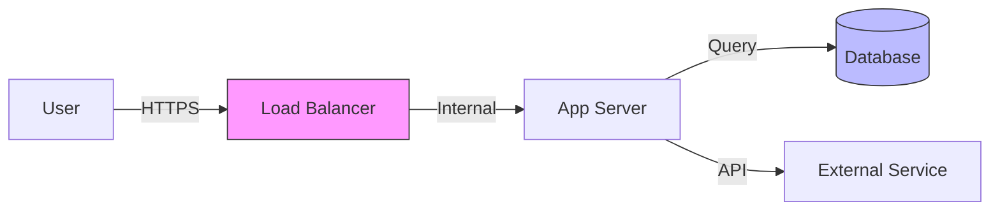
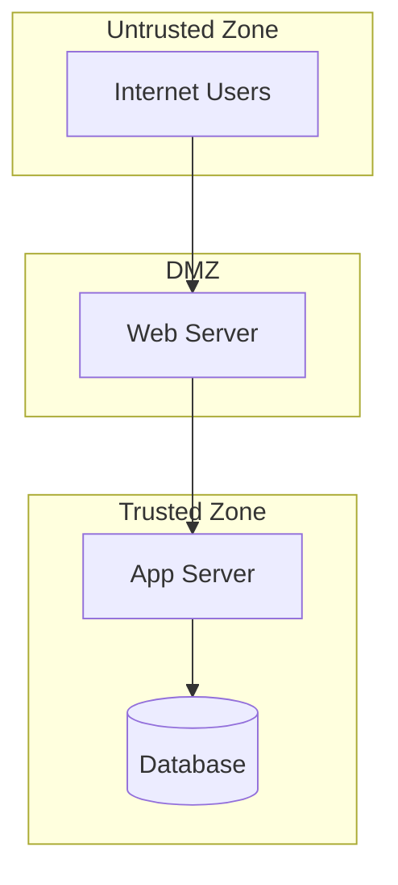

# STRIDE Security Methodology

Guide for comprehensive security analysis using the STRIDE threat modeling framework, vulnerability assessment, and security architecture evaluation.

## When to Use This Skill

Activate when:
- Conducting security threat modeling
- Performing vulnerability assessments
- Evaluating security architecture
- Creating security review documentation
- Generating threat model diagrams
- Assessing security posture of applications

## STRIDE Framework

STRIDE categorizes security threats into six categories:

### S - Spoofing
**Identity theft/impersonation threats**
- User authentication bypass
- Session hijacking
- Credential theft
- Certificate spoofing

### T - Tampering
**Data modification threats**
- SQL injection
- Parameter manipulation
- Man-in-the-middle attacks
- Data store manipulation

### R - Repudiation
**Deniability threats**
- Log tampering
- Missing audit trails
- Insufficient logging
- Non-repudiation failures

### I - Information Disclosure
**Data exposure threats**
- Sensitive data leakage
- Error message exposure
- Directory traversal
- Improper access controls

### D - Denial of Service
**Availability threats**
- Resource exhaustion
- Rate limiting bypass
- Memory leaks
- Infinite loops

### E - Elevation of Privilege
**Authorization bypass threats**
- Privilege escalation
- Role bypass
- Insecure direct object reference
- Broken access control

## Security Analysis Process

### Phase 1: Asset Identification
1. Identify critical data assets
2. Map data flows and trust boundaries
3. Identify entry points and exit points
4. Document authentication mechanisms
5. List third-party dependencies

### Phase 2: Threat Modeling
1. Apply STRIDE to each component
2. Identify threat scenarios
3. Assess likelihood and impact
4. Document attack vectors
5. Create threat diagrams

### Phase 3: Vulnerability Assessment
1. Static code analysis
2. Dependency vulnerability scanning
3. Configuration review
4. Authentication/authorization testing
5. Input validation analysis

### Phase 4: Risk Prioritization
1. Calculate risk scores
2. Prioritize by business impact
3. Identify quick wins
4. Create remediation roadmap
5. Document mitigations

## Threat Model Template

```markdown
## Threat: [STRIDE Category] - [Threat Name]

### Description
[Detailed threat description]

### Attack Vector
[How the attack could be executed]

### Affected Components
- [Component 1]
- [Component 2]

### Risk Assessment
- **Likelihood**: High/Medium/Low
- **Impact**: High/Medium/Low
- **Risk Score**: [Likelihood × Impact]

### Mitigation
- [Mitigation step 1]
- [Mitigation step 2]

### Verification
- [How to verify mitigation is effective]
```

## Mermaid Diagram Patterns

### Data Flow Diagram


### Trust Boundary Diagram


## Security Report Structure

```markdown
# Security Assessment Report

## Executive Summary
- **Overall Risk Level**: [Critical/High/Medium/Low]
- **Critical Issues**: [Count]
- **High Issues**: [Count]
- **Recommendations**: [Top 3 actions]

## Threat Model Analysis
### STRIDE Coverage
- Spoofing: [Finding count]
- Tampering: [Finding count]
- Repudiation: [Finding count]
- Information Disclosure: [Finding count]
- Denial of Service: [Finding count]
- Elevation of Privilege: [Finding count]

## Architecture Diagram
[Mermaid diagram with trust boundaries]

## Findings

### Critical
1. [Finding with STRIDE category]

### High Priority
1. [Finding with STRIDE category]

## Remediation Roadmap
### Immediate (0-7 days)
- [Action items]

### Short-term (1-4 weeks)
- [Action items]

### Long-term (1-3 months)
- [Action items]
```

## Key Principles

- **Defense in Depth**: Multiple security layers
- **Least Privilege**: Minimal access rights
- **Secure by Default**: Safe default configurations
- **Fail Securely**: Handle errors safely
- **Zero Trust**: Verify everything, trust nothing
- **Data Classification**: Protect based on sensitivity
