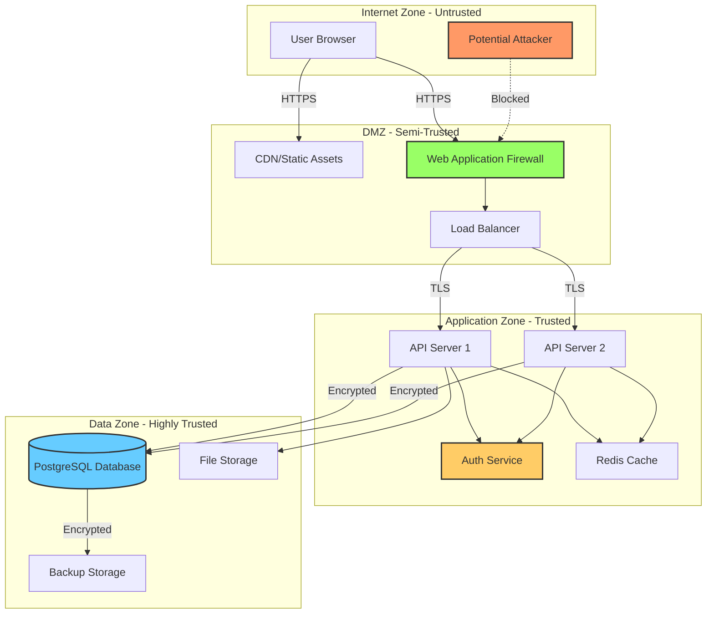
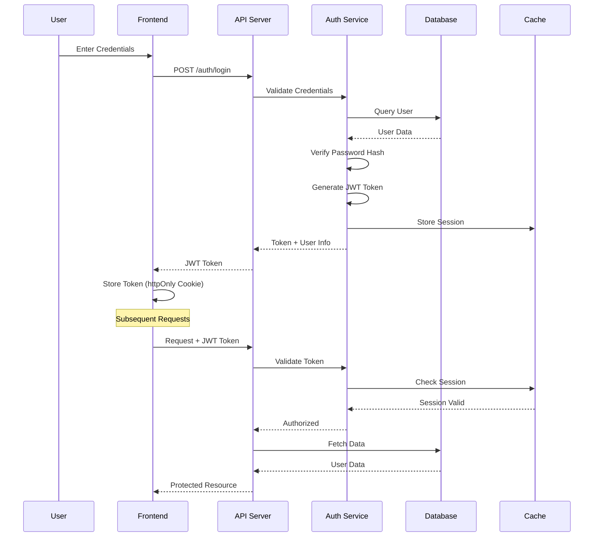
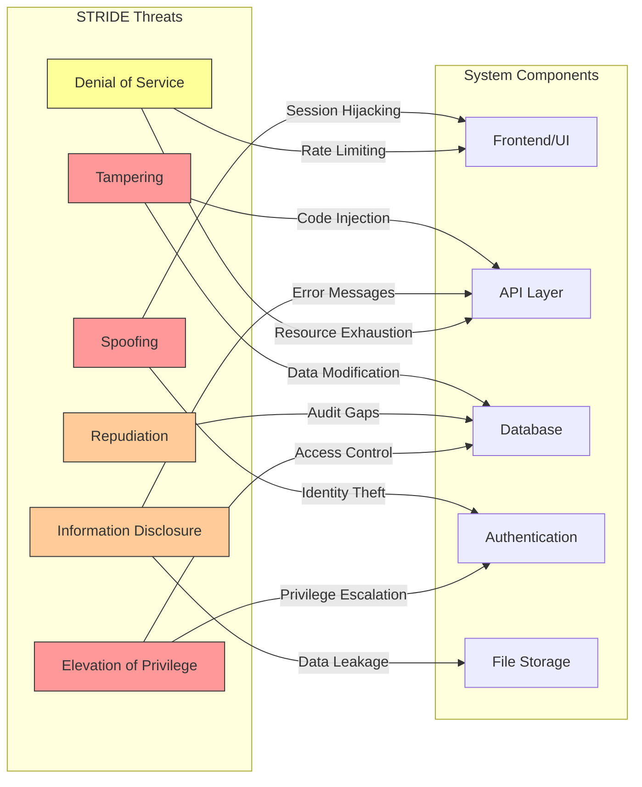
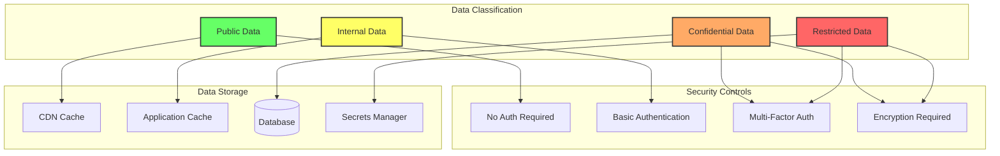
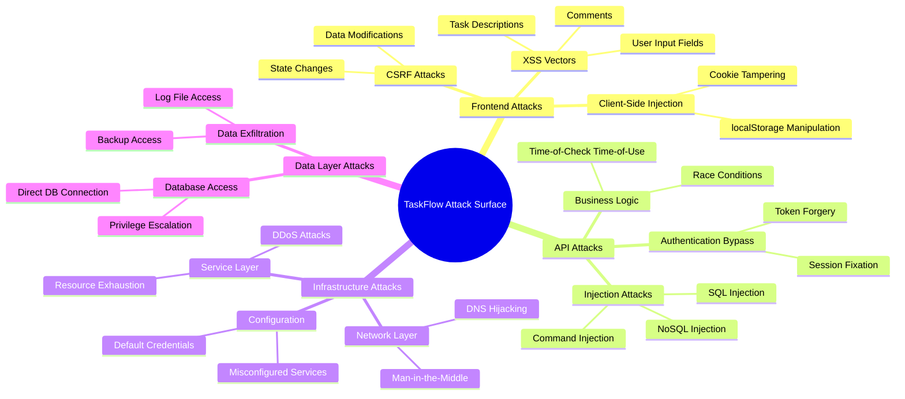
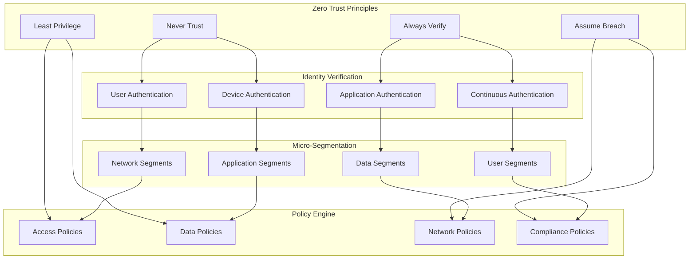
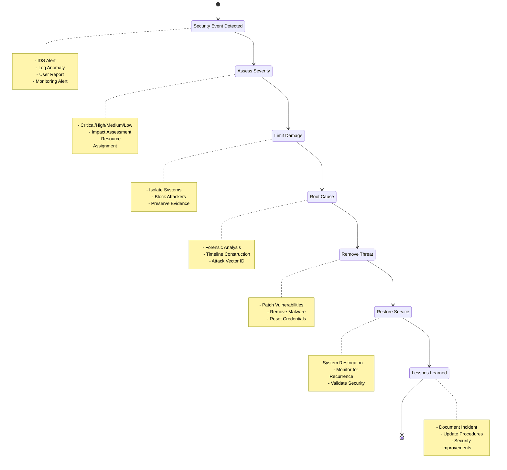
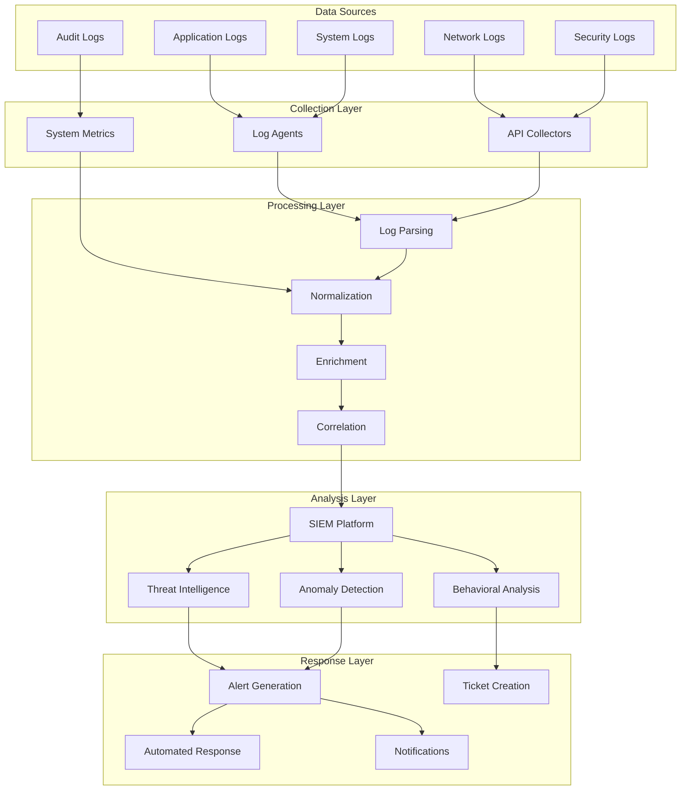
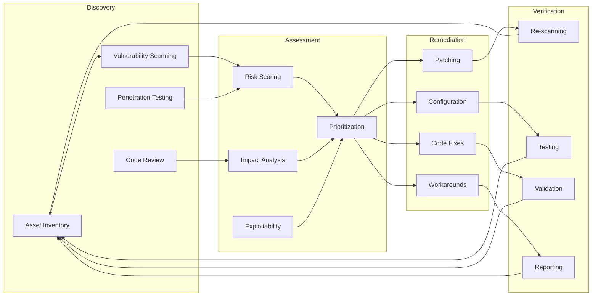

# Security Diagrams - TaskFlow Productivity App

## Overview

This document contains Mermaid diagrams visualizing the security architecture, threat models, and data flows for the TaskFlow productivity application.

## 1. System Architecture Security View

## 2. Authentication and Authorization Flow

## 3. STRIDE Threat Model Visualization

## 4. Data Flow Security Diagram

## 5. Attack Surface Analysis

## 6. Security Control Implementation

```mermaid
graph TB
    subgraph "Preventive Controls"
        InputVal[Input Validation]
        AuthN[Authentication]
        Crypto[Encryption]
        FW[Firewall Rules]
    end
    
    subgraph "Detective Controls"
        IDS[Intrusion Detection]
        LogMon[Log Monitoring]
        AnomalyDet[Anomaly Detection]
        SecScan[Security Scanning]
    end
    
    subgraph "Corrective Controls"
        IncResp[Incident Response]
        Patch[Patch Management]
        Backup[Backup/Recovery]
        Rollback[Rollback Procedures]
    end
    
    subgraph "Threats Mitigated"
        Injection[Injection Attacks]
        Breach[Data Breaches]
        DoS[Service Disruption]
        Unauth[Unauthorized Access]
    end
    
    InputVal -->|Prevents| Injection
    AuthN -->|Prevents| Unauth
    Crypto -->|Prevents| Breach
    FW -->|Prevents| DoS
    
    IDS -->|Detects| Injection
    LogMon -->|Detects| Unauth
    AnomalyDet -->|Detects| Breach
    SecScan -->|Detects| DoS
    
    IncResp -->|Responds to| Breach
    Patch -->|Fixes| Injection
    Backup -->|Recovers from| DoS
    Rollback -->|Reverts| Unauth
    
    style Injection fill:#f99
    style Breach fill:#f99
    style DoS fill:#fc9
    style Unauth fill:#f99
```

## 7. Zero Trust Architecture Model

## 8. Incident Response Flow

## 9. Security Monitoring Architecture

## 10. Vulnerability Management Lifecycle

## Diagram Usage Guide

These diagrams provide visual representations of:

1. **System Architecture**: Overall security zones and component relationships
2. **Authentication Flow**: Detailed authentication and authorization process
3. **STRIDE Model**: Threat categories mapped to system components
4. **Data Classification**: Security controls based on data sensitivity
5. **Attack Surface**: Comprehensive view of potential attack vectors
6. **Security Controls**: Preventive, detective, and corrective control implementation
7. **Zero Trust Model**: Modern security architecture approach
8. **Incident Response**: Security incident handling workflow
9. **Monitoring Architecture**: Security monitoring and analysis pipeline
10. **Vulnerability Management**: Continuous vulnerability discovery and remediation

Each diagram can be rendered using Mermaid-compatible tools and should be updated as the security architecture evolves.

## Document Status
- **Diagram Version**: 1.0
- **Created**: 2025-09-07
- **Format**: Mermaid markdown
- **Next Update**: With architecture changes